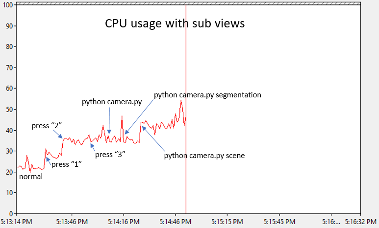

# 카메라 뷰

화면에 표시되는 카메라 뷰는 [simGetImages API](image_apis.md)를 통해 가져올 수 있는 카메라 뷰입니다.


왼쪽에서 오른쪽으로 깊이 뷰, 분할 뷰 및 FPV 뷰가 있습니다. 사용 가능한 다양한 뷰에 대한 설명은 [이미지 API](image_apis.md)를 참조하십시오.

## 뷰 ON/OFF

F1 키를 눌러 모든 뷰를 설정/해제하기 위한 바로 가기 키를 확인하십시오. "Fly with Me" 모드, FPV 모드 및 "Ground View" 모드와 같은 다양한 뷰 모드를 선택할 수도 있습니다.

## 하위 창 구성

이제 위의 각 하위 창에 표시되는 것을 선택할 수 있습니다. 예를 들어 첫 번째 창(깊이 대신)에 표면 정규식을 표시하고 두 번째 창(segmentation 대신)에 불균형을 표시하도록 선택할 수 있다. 다음은 [settings.json](settings.md)에서 사용할 수있는 설정 값입니다:

```
{
  "SubWindows": [
    {"Index": 1, "ImageType": 5},
    {"Index": 2, "ImageType": 3}
  ]
}
```

## 성능 영향

*참고* :이 섹션은 오래되었으며 새로운 성능 향상 변경 사항으로 업데이트 되지 않았습니다.

이 뷰를 렌더링하면 GPU의 추가 작업이므로 게임의 FPS 성능에 영향을 줍니다. 다음은 이러한 뷰를 열 때 FPS에 미치는 영향을 보여줍니다.


이는 32GB RAM이있는 Intel 코어 i7 컴퓨터와 모듈 식 이웃 맵을 실행하는 GeForce GTX 1080 그래픽 카드에서 쿠킹 된 디버그 비트를 사용하여 디버거나 GameEditor가 열려 있지 않은 상태에서 측정됩니다. 서브 뷰가 열려 있지 않은 정상 상태는 프레임 당 약 16ms를 측정하므로 60FPS(목표 FPS)를 일정하게 유지합니다. 최대 35ms까지 올라가면 FPS는 초당 약 28 프레임으로 떨어지며, 40ms로 급상승하면 25fps로 떨어집니다.

물리가 렌더링에서 분리되어 있기 때문에 최악의 경우에도 시뮬레이터가 계속 작동하고 올바르게 비행 할 수 있습니다. 그러나 CPU 사용량이 너무 많아 PX4 하드웨어와의 통신이 중단되어 지연이 너무 높아지면 오프 보드 제어 메시지의 시간 초과로 인해 비행이 중단 될 수 있습니다.

드론이 측정된 컴퓨터에서는 모든 뷰가 열려 있고 각 뷰 유형을 캡처하기 위해 3개의 피톤 스크립트가 실행된 상태에서 아무 문제 없이 path.py 프로그램을 띄울 수 있었습니다. 그러나 이 비행 중에 한 번의 실속이 있었지만 정상적으로 회복되어 완주했습니다. 한계에 다다랐지만 괜찮았습니다.

다음은 CPU에 미치는 영향을 보여줍니다. 놀랍게도 CPU에 미치는 영향도 사소한 것이 아닙니다.


