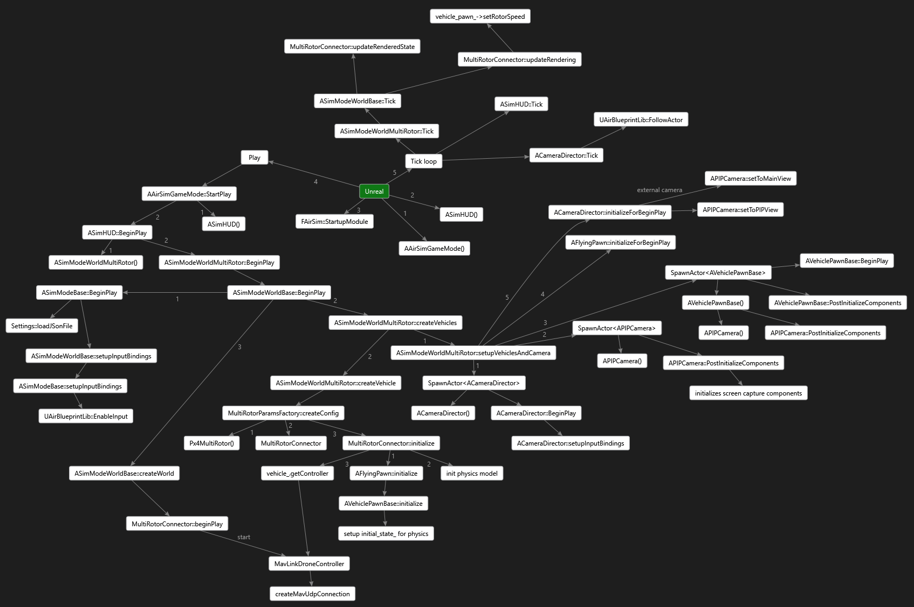

## AirLib

코드의 대부분은 AirLib에 있습니다. 이 라이브러리는 C++ 11 컴파일러로 컴파일 할 수 있는 독립적인 라이브러리입니다.

AirLib는 다음 구성 요소로 구성됩니다:
1. *Physics engine:* 이것은 header-only 물리 엔진입니다. 다양한 차량을 구현할 수 있도록 빠르고 확장 가능하도록 설계되었습니다.
2. *Sensor models:* 기압계, IMU, GPS 및 자력계의 header-only 모델입니다
3. *Vehicle models:* 차량 구성 및 모델을 위한 header-only 모델입니다. 현재 X 설정에서 MultiRotor 모델과 PX4 QuadRotor 구성을 구현했습니다.
4. *Control library:* AirLib의 이 부분은 API에 대한 추상 기본 클래스를 제공하고 MavLink와 같은 특정 차량 플랫폼에 대한 구체적인 구현을 제공합니다. RPC 클라이언트 및 서버에 대한 클래스도 있습니다.

## Unreal/Plugins/AirSim

Unreal Engine에 의존하는 프로젝트의 유일한 부분입니다. 다른 플랫폼(예 : Unity)에 대한 시뮬레이터를 구현할 수 있도록 격리 된 상태로 유지했습니다. Unreal 코드는 블루 프린트를 포함한 UObject 기반 클래스를 활용합니다.
1. *SimMode_ classes*: 드론이 없는 순수한 Computer Vision 모드와 같은 다양한 시뮬레이터 모드를 지원하고자 합니다. SimMode 클래스는 다양한 모드를 구현하는 데 도움이 됩니다.
2. *VehiclePawnBase*: 이것은 모든 차량 pawn 시각화의 기본 클래스입니다.
3. *VehicleBase*: 이 클래스는 렌더링 구성 요소(예: Unreal Pawn), 물리 구성 요소(예: MultiRotor) 및 컨트롤러(예: MavLinkHelper)의 조합을 구현하는 추상 인터페이스를 제공합니다.

## MavLinkCom

이것은 우리 팀원 [Chris Lovett](https://github.com/lovettchris)이 개발 한 라이브러리로 MavLink 장치와 통신하기 위한 C ++ 클래스를 제공합니다. 이 라이브러리는 독립형이며 모든 프로젝트에서 사용할 수 있습니다.
자세한 내용은 [MavLinkCom](https://github.com/Microsoft/AirSim/tree/master/MavLinkCom//README.md)을 참조하십시오.

## 샘플 프로그램
API 사용 방법을 보여주기 위해 몇 가지 샘플 프로그램을 만들었습니다. HelloDrone 및 DroneShell을 참조하십시오.
DroneShell은 UDP를 사용하여 시뮬레이터에 연결하는 방법을 보여줍니다. 시뮬레이터가 서버를 실행 중 입니다(DroneServer와 유사).

## 기여

[기여 가이드라인](../CONTRIBUTING.md)을 보십시오.

## Unreal Framework

다음 그림은 Unreal 게임 엔진이 AirSim을 로드하고 호출하는 방법을 보여줍니다.

