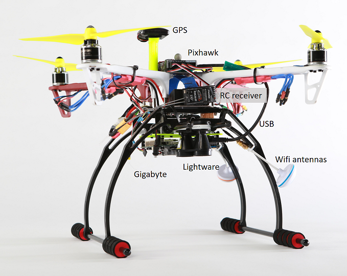

# 실제 드론의 AirLib

AirLib 라이브러리는 컴패니언 컴퓨터에서 실제 드론으로 컴파일 및 배포 할 수 있습니다. 테스트를 위해 USB를 통해 Pixhawk 비행 컨트롤러에 연결된 드론에 Gigabyte Brix BXi7-5500 초소형 PC를 장착했습니다. 기가 바이트 PC는 Ubuntu를 실행하므로 Wi-Fi를 통해 SSH로 연결할 수 있습니다:



연결되면 다음 명령 줄을 사용하여 MavLinkTest를 실행할 수 있습니다:
````
MavLinkTest -serial:/dev/ttyACM0,115200 -logdir:. 
````
그러면 비행 로그 파일이 생성되어 [시뮬레이터에서 재생](playback.md)에 사용될 수 있습니다.

`-proxy:192.168.1.100:14550`을 추가하여 MavLinkTest를 원격 컴퓨터에 연결하여 QGroundControl 또는 [PX4 Log Viewer](log_viewer.md)를 실행할 수 있는 원격 컴퓨터에 연결할 수 있습니다.

MavLinkTest에는 드론 테스트를 위한 간단한 명령이 있습니다. 다음은 몇 가지 명령의 간단한 예입니다:

````
arm
takeoff 5
orbit 10 2
````

이것은 드론을 준비시키고, 5미터를 이륙 한 다음 2m/s로 반경 10 미터 궤도를 도는 패턴을 수행합니다.
'?'를 입력하면 사용 가능한 모든 커맨드를 보여줍니다.

**참고:** 일부 명령(예: `orbit`)은 이름이 다르고 MavLinkTest 및 DroneShell에서 구문이 다릅니다(예: `circlebypath -radius 10 -velocity 21`).

드론이 착륙하면 MavLinkTest를 중지하고 생성된 *.mavlink 로그 파일을 복사 할 수 있습니다.

# DroneServer와 DroneShell

MavLinkTest가 작동하면 다음과 같이 DroneServer 및 DroneShell을 실행할 수도 있습니다. 먼저 로컬 프록시로 MavLinkTest를 실행하여 모든 것을 DroneServer로 보냅니다.

````
MavLinkTest -serial:/dev/ttyACM0,115200 -logdir:. -proxy:127.0.0.1:14560
````
DroneServer가 이 UDP 연결을 찾도록 하기 위해 ~/Documents/AirSim/settings.json의 값을 "serial":false로 변경하십시오.

````
DroneServer 0
````

마지막으로 DroneShell을 이 DroneServer 인스턴스에 연결하고 DroneShell 명령을 사용하여 드론을 비행 할 수 있습니다.

````
DroneShell
==||=>
        Welcome to DroneShell 1.0.
        Type ? for help.
        Microsoft Research (c) 2016.

Waiting for drone to report a valid GPS location...
==||=> requestcontrol
==||=> arm
==||=> takeoff
==||=> circlebypath -radius 10 -velocity 2
````

## PX4 전용 도구
MavlinkCom 라이브러리 및 MavLinkTest 앱을 실행하여 컴패니언 컴퓨터와 비행 컨트롤러 간의 연결을 테스트 할 수 있습니다.

## 어떻게 작동합니까?
AirSim은 @lovettchris가 개발한 MavLinkCom 구성 요소를 사용합니다. MavLinkCom에는 직렬 또는 UDP를 사용하여 PX4에 대한 연결을 열고 다른 구성 요소가 이 연결을 공유 할 수 있는 프록시 아키텍처가 있습니다. PX4가 MavLink 메시지를 보내면 모든 구성 요소가 해당 메시지를 받습니다. 어떤 구성 요소가 메시지를 보내면 PX4에서만 메시지를 받습니다. 이를 통해 PX4에 여러 구성 요소를 연결할 수 있습니다. [이 코드](https://github.com/Microsoft/AirSim/blob/master/AirLib/include/vehicles/multirotor/controllers/MavLinkDroneController.hpp#L793)는 LogViewer 및 QGC에 대한 연결을 엽니다. 원한다면 더 많은 것을 추가 할 수 있습니다.

QGC + AirSim을 함께 사용하려면 직렬 포트를 소유하기 위해 QGC가 필요합니다. QGC는 다른 구성 요소가 QGC에 연결하여 MavLinkMessage를 QGC로 보낸 후 QGC가 해당 메시지를 PX4로 전달할 수 있도록 프록시 역할을 하는 TCP 연결을 엽니다. 따라서 AirSim에게 QGC에 연결하고 QGC가 자체 직렬 포트를 갖도록 지시합니다.

컴패니언 보드의 경우, 이전에 수행 한 방식은 드론에 기가 바이트 브릭스를 두는 것이 었습니다. 이 x86 full-fledged 컴퓨터는 USB를 통해 PX4에 연결됩니다. 우리는 브릭스에 우분투를 두고 [DroneServer](https://github.com/Microsoft/AirSim/tree/master/DroneServer)를 운영했습니다. DroneServer는 C++ 클라이언트 코드(또는 Python 코드)를 통해 대화 할 수 있는 API 엔드 포인트를 생성하고 API 호출을 MavLink 메시지로 변환했습니다. 이렇게하면 동일한 API에 대해 코드를 작성하고 시뮬레이터에서 테스트 한 다음 실제 차량에서 동일한 코드를 실행할 수 있습니다. 따라서 컴패니언 컴퓨터에는 클라이언트 코드와 함께 DroneServer가 실행됩니다.
