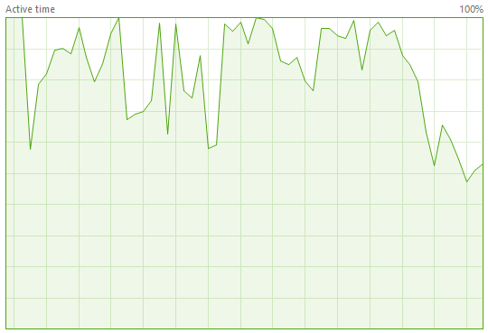

# Busy Hard Drive

필수는 아니지만 SSD (Solid State Drive)에서 Unreal 환경을 실행하는 것이 좋습니다.
디버깅, 로깅 및 Unreal 에셋 로딩 사이에서 하드 드라이브를 로드하면 병목현상이 발생할 수 있습니다.
Unreal이 환경을 로드하는 동안 하드 드라이브가 다운되는 것은 일반적이지만 Unreal 게임이 실행되는 동안 하드 드라이브 성능이 이와 같으면 비행 경험이 좋지 않을 것입니다.

실제로, 하드 드라이브가 이 사용량이 많으면 드론이 제대로 비행하지 않을 가능성이 있습니다.
알 수없는 이유로 이 I/O 병목 현상이 드론 제어 루프를 방해하고 해당 루프가 높은 속도 (300-500 Hz)로 작동하지 않으면 드론이 비행하지 않습니다.
Pixhawk 비행 컨트롤러에서 실행되는 PX4 펌웨어 내부의 제어 루프는 1000Hz에서 실행됩니다.

### I/O 줄이기

이번 주말에 Fry's Electronics에 접속할 수 없고 고가의 초고속 SSD를 구할 수 없다면,
다음 단계를 수행하여 하드 드라이브 I/O를 줄일 수 있습니다:

1. 먼저 UE 에디터 외부 또는 쿠킹 환경 밖에서 쿠킹 된 컨텐츠를 사용하여 Unreal 환경을 실행하고 컨텐츠를 가장 빠른 SSD 드라이브에 패키징하십시오.
이 메뉴 옵션을 사용하여 이를 수행 할 수 있습니다:

2. 게임 에셋을 적극적으로 수정하고 있기 때문에 UE 에디터를 사용해야 한다면 최소한 디버거에서 실행하지 마십시오.
Visual Studio를 사용하는 경우 디버깅 없이 시작을 사용하십시오.
3. 앱을 디버깅해야하고 Visual Studio 디버거를 사용하는 경우 Visual Studio에서 Intellitrace 정보 로깅을 중지하십시오.
Tools/Options/Debugging/Intellitrace로 이동하여 메인 체크박스를 해제합니다.
4. 환경에서 활성화 한 [Unreal Analytics](https://docs.unrealengine.com/latest/INT/Gameplay/Analytics/index.html), 특히 모든 파일 로깅을 끄십시오.

### Page Faults로부터의 I/O

시스템에 RAM이 부족하면 메모리를 디스크로 페이징하기 시작할 수 있습니다.
운영 체제가 디스크에 페이징을 사용하도록 설정 한 경우 가장 빠른 SSD로 페이징되고 있는지 확인하십시오.
또는 RAM이 충분한 경우 페이징을 모두 비활성화하십시오.
사실, 페이징을 사용하지 않도록 설정하고 게임이 작동하지 않으면 RAM이 부족함을 알 수 있습니다.

분명히, 다른 불필요한 앱을 종료하면 메모리가 비워 지므로 메모리가 부족해지지 않습니다.

### 이상적인 런타임 성능

UE 에디터에서 비행 할 때 느린 하드 드라이브 모습입니다.
당신은 그것이 매우 바쁘다는 것을 알 수 있지만, 드론은 여전히 ​​잘 비행합니다:

드론이 Unreal 쿠킹(Unreal Cooked) 앱(UE 에디터, 디버거 없음)에서 비행 할 때의 빠른 SSD 모습입니다.
당연히 이 경우에는 완벽하게 날고 있습니다.

