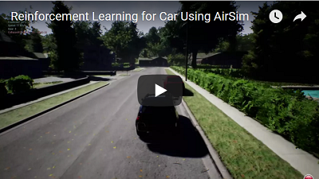

# AirSim의 강화 학습

아래에서는 CNTK를 사용하여 AirSim에서 DQN을 구현하는 방법에 대해 설명합니다. 가장 쉬운 방법은 먼저 파이썬 전용 CNTK를 설치 하는 것입니다([명령](https://docs.microsoft.com/en-us/cognitive-toolkit/setup-windows-python?tabs=cntkpy22)).

CNTK는 [deep RL](https://github.com/Microsoft/CNTK/tree/master/Examples/ReinforcementLearning)의 몇 가지 데모 예제를 제공합니다. AirSim과 작동하도록 DeepQNeuralNetwork.py를 수정합니다. 우리는 DQN 알고리즘에 해당하는 대부분의 클래스와 메소드를 활용할 수 있습니다. 그러나 AirSim을 위해 추가해야 할 사항이 있습니다.

#### Disclaimer
이것은 여전히 ​​활발히 개발 중입니다. 아래에서 공유하는 것은 더 나은 성능을 얻기 위해 확장 및 조정 가능한 프레임 워크입니다.

## 자동차의 RL

[Source code](https://github.com/Microsoft/AirSim/tree/master/PythonClient//car/DQNcar.py)

이 예제는 [릴리스](https://github.com/Microsoft/AirSim/releases)에서 사용 가능한 AirSimNeighborhood 환경에서 작동합니다.

먼저 시뮬레이션에서 이미지를 가져와서 적절히 변환해야 합니다. 아래에서는 ego 카메라에서 깊이 이미지를 가져 와서 네트워크에 84X84 입력으로 변환하는 방법을 보여줍니다. (다른 센서 양식과 센서 입력도 사용할 수 있습니다. 물론 코드를 적절히 수정해야 합니다).

```
responses = client.simGetImages([ImageRequest(0, AirSimImageType.DepthPerspective, True, False)])
current_state = transform_input(responses)
```

또한 에이전트가 실행할 수 있는 6 가지 작업(분할, throttle을 사용한 직선, throttle을 사용한 왼쪽 전체, throttle을 사용한 오른쪽 전체, throttle이 있는 왼쪽 절반, throttle이 있는 오른쪽 절반)을 정의합니다. 이것은 `interpret_action` 함수를 통해 이루어집니다:

```
def interpret_action(action):
    car_controls.brake = 0
    car_controls.throttle = 1
    if action == 0:
        car_controls.throttle = 0
        car_controls.brake = 1
    elif action == 1:
        car_controls.steering = 0
    elif action == 2:
        car_controls.steering = 0.5
    elif action == 3:
        car_controls.steering = -0.5
    elif action == 4:
        car_controls.steering = 0.25
    else:
        car_controls.steering = -0.25
    return car_controls
```

그런 다음 `compute_reward`의 reward function은 차량이 얼마나 빨리 이동하는지와 중심선에서 얼마나 많이 벗어나는지의 convex 조합으로 정의됩니다. 에이전트는 빠르게 이동하고 차선 중앙에 머무를 때 높은 reward을 받습니다.

```
def compute_reward(car_state):
    MAX_SPEED = 300
    MIN_SPEED = 10
    thresh_dist = 3.5
    beta = 3

    z = 0
    pts = [np.array([0, -1, z]), np.array([130, -1, z]), np.array([130, 125, z]), np.array([0, 125, z]), np.array([0, -1, z]), np.array([130, -1, z]), np.array([130, -128, z]), np.array([0, -128, z]), np.array([0, -1, z])]
    pd = car_state.position
    car_pt = np.array(list(pd.values()))

    dist = 10000000
    for i in range(0, len(pts)-1):
        dist = min(dist, np.linalg.norm(np.cross((car_pt - pts[i]), (car_pt - pts[i+1])))/np.linalg.norm(pts[i]-pts[i+1]))

    #print(dist)
    if dist > thresh_dist:
        reward = -3
    else:
        reward_dist = (math.exp(-beta*dist) - 0.5)
        reward_speed = (((car_state.speed - MIN_SPEED)/(MAX_SPEED - MIN_SPEED)) - 0.5)
        reward = reward_dist + reward_speed

    return reward
```

함수 `isDone`은 에피소드가 종료되었는지 여부를 결정합니다(예: 충돌로 인해). 우리는 차량의 속도를 살펴보고 그것이 임계값보다 작으면 에피소드가 종료 된 것으로 간주됩니다.

```
def isDone(car_state, car_controls, reward):
    done = 0
    if reward < -1:
        done = 1
    if car_controls.brake == 0:
        if car_state.speed <= 5:
            done = 1
    return done
```

그런 다음 메인 루프는 이미지 획득, 현재 정책에 따라 수행 할 작업 계산, reward 등을 통해 시퀀스됩니다.
에피소드가 종료되면 다음을 통해 차량을 원래 상태로 재설정합니다:

```
client.reset()
client.enableApiControl(True)
client.armDisarm(True)
car_control = interpret_action(1) // Reset position and drive straight for one second
client.setCarControls(car_control)
time.sleep(1)
```

DQNcar.py를 실행하기 전에 시뮬레이션을 시작하고 실행해야 합니다. 아래 비디오는 DQN training의 몇가지 에피소드를 보여줍니다.

[](https://youtu.be/fv-oFPAqSZ4)

## 쿼드 로터의 RL

[Source code](https://github.com/Microsoft/AirSim/tree/master/PythonClient//multirotor/DQNdrone.py)

이 예제는 [릴리스](https://github.com/Microsoft/AirSim/releases)에서 사용 가능한 AirSimMountainLandscape 환경에서 작동합니다.

쿼드 로터를 사용하여 다양한 자율 비행 시나리오에 RL을 유사하게 적용 할 수 있습니다. 아래는 RL을 사용하여 쿼드 로터가 고압 전력선을 따르도록 훈련하는 방법에 대한 예 입니다(예: 에너지 인프라 검사 애플리케이션).
여기에는 쿼드 로터가 이동할 수 있는 다른 방향에 해당하는 7가지 동작이 있습니다 (6방향 + 하나의 호버링 동작).

```
def interpret_action(action):
    if action == 0:
        quad_offset = (0, 0, 0)
    elif action == 1:
        quad_offset = (1, 0, 0)
    elif action == 2:
        quad_offset = (0, 1, 0)
    elif action == 3:
        quad_offset = (0, 0, 1)
    elif action == 4:
        quad_offset = (-1, 0, 0)    
    elif action == 5:
        quad_offset = (0, -1, 0)
    elif action == 6:
        quad_offset = (0, 0, -1)
    return quad_offset
```

다시 reward 쿼드가 알려진 전력선으로부터 얼마나 멀리 떨어져 있는지와 함께 쿼드가 얼마나 빨리 이동하는지에 대한 함수입니다.

```
def compute_reward(quad_state, quad_vel, collision_info):
    thresh_dist = 10
    beta = 1

    z = -10
    pts = [np.array([0, 0, z]), np.array([130, 0, z]), np.array([130, 125, z]), np.array([0, 125, z]), np.array([0, 0, z]), np.array([130, 0, z]), np.array([130, -128, z]), np.array([0, -128, z]), np.array([0, 0, z])]
    quad_pt = np.array(list((quad_state.x_val, quad_state.y_val, quad_state.z_val)))

    if collision_info.has_collided:
        reward = -100
    else:    
        dist = 10000000
        for i in range(0, len(pts)-1):
            dist = min(dist, np.linalg.norm(np.cross((quad_pt - pts[i]), (quad_pt - pts[i+1])))/np.linalg.norm(pts[i]-pts[i+1]))

        if dist > thresh_dist:
            reward = -10
        else:
            reward = 2*(0.5 - math.exp(-beta*dist)) + np.linalg.norm([quad_vel.x_val, quad_vel.y_val, quad_vel.z_val])

    return reward
```

알려진 전력선 좌표에서 너무 많이 표류하면 에피소드가 종료되는 것으로 간주합니다.

여기서 재설정 기능은 쿼드 로터를 초기 시작점으로 해서 비행합니다:

```
    if done:
        client.moveToZAsync(clearZ, 2).join()
        client.moveToPositionAsync(initX, initY, clearZ, 2).join()
        client.moveToPositionAsync(initZ, initY, initZ, 2).join()
        current_step +=1
```

다음은 훈련 중 처음 몇 에피소드의 비디오입니다.

[](https://youtu.be/uKm15Y3M1Nk)

## 관련
 Microsoft Deep Learning 및 Robotics Garage Chapter의 [The Autonomous Driving Cookbook](https://aka.ms/AutonomousDrivingCookbook)도 참조하십시오.
