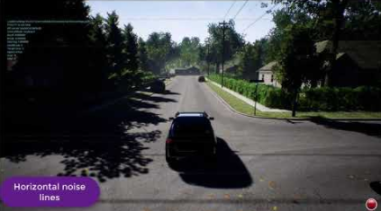

# AirSim 설정

## 설정은 어디에 저장됩니까?
Windows: `Documents\AirSim`
Linux: `~/Documents/AirSim`

파일은 일반적인 [json 형식](https://en.wikipedia.org/wiki/JSON)입니다. 처음 시작할 때 AirSim은 설정없이 `settings.json` 파일을 생성합니다. 문제를 피하려면 항상 ASCII 형식을 사용하여 json 파일을 저장하십시오.

## 자동차와 멀티 로터를 어떻게 선택합니까?
기본값은 멀티 로터를 사용하는 것입니다. 자동차를 사용하려면 다음과 같이 `"SimMode": "Car"`로 설정하십시오:

```
{
  "SettingsVersion": 1.2,
  "SimMode": "Car"
}
```

멀티 로터를 선택하려면 `"SimMode": "Multirotor"`로 설정하십시오. 차량 종류를 선택하라는 메시지를 표시하려면 `"SimMode": ""`를 사용하십시오.

## 사용 가능한 설정 및 기본 값
아래는 기본값과 함께 사용 가능한 전체 설정 목록입니다. json 파일에서 누락 된 설정이 있으면 기본값이 사용됩니다. 일부 기본값은 단순히 `""`로 지정되는데, 이는 실제 차량이 사용중인 차량에 따라 선택 될 수 있음을 의미합니다. 예를 들어, `ViewMode` 설정에는 기본 값 `""`이 있으며 드론의 경우 `"FlyWithMe"`로, 자동차의 경우 `"SpringArmChase"`로 해석됩니다.

**주의:** settings.json에 아래의 모든 내용을 붙여 넣지 마십시오. 기본값을 원하지 않는 설정만 추가하는 것이 좋습니다. 필요한 요소는 "SettingsVersion" 뿐 입니다.

```
{
  "SimMode": "",
  "ClockType": "",
  "ClockSpeed": 1,
  "LocalHostIp": "127.0.0.1",
  "RecordUIVisible": true,
  "LogMessagesVisible": true,
  "ViewMode": "",
  "RpcEnabled": true,
  "EngineSound": true,
  "PhysicsEngineName": "",
  "SpeedUnitFactor": 1.0,
	"SpeedUnitLabel": "m/s",
  "Recording": {
    "RecordOnMove": false,
    "RecordInterval": 0.05,
    "Cameras": [
        { "CameraName": "0", "ImageType": 0, "PixelsAsFloat": false, "Compress": true }
    ]
  },
  "CameraDefaults": {
    "CaptureSettings": [
      {
        "ImageType": 0,
        "Width": 256,
        "Height": 144,
        "FOV_Degrees": 90,
        "AutoExposureSpeed": 100,
        "AutoExposureBias": 0,
        "AutoExposureMaxBrightness": 0.64,
        "AutoExposureMinBrightness": 0.03,
        "MotionBlurAmount": 0,
        "TargetGamma": 1.0,
        "ProjectionMode": "",
        "OrthoWidth": 5.12
      }
    ],
    "NoiseSettings": [
      {
        "Enabled": false,
        "ImageType": 0,

        "RandContrib": 0.2,
        "RandSpeed": 100000.0,
        "RandSize": 500.0,
        "RandDensity": 2,

        "HorzWaveContrib":0.03,			
        "HorzWaveStrength": 0.08,
        "HorzWaveVertSize": 1.0,
        "HorzWaveScreenSize": 1.0,
        
        "HorzNoiseLinesContrib": 1.0,
        "HorzNoiseLinesDensityY": 0.01,
        "HorzNoiseLinesDensityXY": 0.5,
        
        "HorzDistortionContrib": 1.0,
        "HorzDistortionStrength": 0.002
      }
    ],
    "Gimbal": {
      "Stabilization": 0,
      "Pitch": NaN, "Roll": NaN, "Yaw": NaN
    }
    "X": NaN, "Y": NaN, "Z": NaN,
    "Pitch": NaN, "Roll": NaN, "Yaw": NaN    
  },
  "OriginGeopoint": {
    "Latitude": 47.641468,
    "Longitude": -122.140165,
    "Altitude": 122
  },
  "TimeOfDay": {
    "Enabled": false,
    "StartDateTime": "",
    "CelestialClockSpeed": 1,
    "StartDateTimeDst": false,
    "UpdateIntervalSecs": 60
  },
  "SubWindows": [
    {"WindowID": 0, "CameraName": "0", "ImageType": 3, "Visible": false},
    {"WindowID": 1, "CameraName": "0", "ImageType": 5, "Visible": false},
    {"WindowID": 2, "CameraName": "0", "ImageType": 0, "Visible": false}    
  ],
  "SegmentationSettings": {
    "InitMethod": "",
    "MeshNamingMethod": "",
    "OverrideExisting": false
  },
  "PawnPaths": {
    "BareboneCar": {"PawnBP": "Class'/AirSim/VehicleAdv/Vehicle/VehicleAdvPawn.VehicleAdvPawn_C'"},
    "DefaultCar": {"PawnBP": "Class'/AirSim/VehicleAdv/SUV/SuvCarPawn.SuvCarPawn_C'"},
    "DefaultQuadrotor": {"PawnBP": "Class'/AirSim/Blueprints/BP_FlyingPawn.BP_FlyingPawn_C'"},
    "DefaultComputerVision": {"PawnBP": "Class'/AirSim/Blueprints/BP_ComputerVisionPawn.BP_ComputerVisionPawn_C'"}
  },
  "Vehicles": {
    "SimpleFlight": {
      "VehicleType": "SimpleFlight",
      "DefaultVehicleState": "Armed",
      "AutoCreate": true,
      "PawnPath": "",
      "EnableCollisionPassthrogh": false,
      "EnableCollisions": true,
      "AllowAPIAlways": true,
      "RC": {
        "RemoteControlID": 0,
        "AllowAPIWhenDisconnected": false
      },
      "Cameras": {   
        //same elements as CameraDefaults above, key as name
      },
      "X": NaN, "Y": NaN, "Z": NaN,
      "Pitch": NaN, "Roll": NaN, "Yaw": NaN
    },
    "PhysXCar": {
      "VehicleType": "PhysXCar",
      "DefaultVehicleState": "",
      "AutoCreate": true,
      "PawnPath": "",
      "EnableCollisionPassthrogh": false,
      "EnableCollisions": true,
      "RC": {
        "RemoteControlID": -1
      },
      "Cameras": {   
        "MyCamera1": {
          //same elements as elements inside CameraDefaults above
        },
        "MyCamera2": {
          //same elements as elements inside CameraDefaults above
        },        
      },
      "X": NaN, "Y": NaN, "Z": NaN,
      "Pitch": NaN, "Roll": NaN, "Yaw": NaN      
    }
  }
}
```

## SimMode
SimMode는 사용할 시뮬레이션 모드를 결정합니다. 다음은 현재 지원되는 값입니다:
- `""`: 사용자에게 차량 타입으로 멀티 로터 또는 자동차를 선택하라는 메시지를 표시
- `"Multirotor"`: 멀티로터 시뮬레이션 사용
- `"Car"`: 자동차 시뮬레이션 사용
- `"ComputerVision"`: 카메라만 사용하고, 차량이나 물리는 사용하지 않음

## ViewMode 
ViewMode는 기본으로 사용할 카메라와 카메라가 차량을 따르는 방법을 결정합니다. 멀티 로터의 경우 기본 ViewMode는 `"FlyWithMe"`이고 자동차의 경우 기본 ViewMode는 `"SpringArmChase"`입니다.

* `FlyWithMe`: 6의 자유도로 자동차를 뒤에서 추적
* `GroundObserver`: 지면에서 6인치 높이로 차량을 추격하되 XY 평면에서 완전히 자유롭습니다.
* `Fpv`: 차량의 전면 카메라에서 씬을 봅니다.
* `Manual`: 카메라를 자동으로 움직이지 마십시오. 카메라를 수동으로 이동하려면 방향 키와 ASWD 키를 사용하십시오.
* `SpringArmChase`: 스프링을 통해 차량에 부착된(보이지 않는) 팔(arm)에 장착된 카메라로 차량을 추적합니다(이동 지연 시간이 약간 있음).
* `NoDisplay`: 메인 화면의 렌더링은 고정되지만 하위 창, 레코딩 및 API의 렌더링은 활성 상태로 유지됩니다. 이 모드는 이미지를 얻는 데에만 관심이 있고 기본 화면에 렌더링되는 내용에 신경 쓰지 않는 "headless"모드로 리소스를 저장하는 데 유용합니다. 이렇게 하면 이미지 기록을 위한 FPS도 향상될 수 있습니다.

## TimeOfDay
이 설정은 환경에서 태양의 위치를 ​​제어합니다. 기본적으로 `Enabled`는 false입니다. 이는 태양의 위치가 환경의 기본값에 그대로 있고 시간이 지나도 변하지 않음을 의미합니다. `Enabled`가 true 인 경우, 태양 위치는 `StartDateTime`에 지정된 날짜의 `OriginGeopoint` 섹션에 지정된 경도, 위도 및 고도를 사용하여 문자열 형식으로 [%Y-%m-%d %H:%M:%S](https://en.cppreference.com/w/cpp/io/manip/get_time)으로 계산됩니다(예 :`2018-02-12 15:20:00`). 이 문자열이 비어 있으면 현재 날짜와 시간이 사용됩니다. `StartDateTimeDst`가 true이면 일광 절약 시간에 맞게 조절 합니다. 그런 다음 `UpdateIntervalSecs`에 지정된 간격으로 태양의 위치가 지속적으로 업데이트됩니다. 경우에 따라 천체 시계가 시뮬레이션 시계보다 빠르거나 느리게 실행되도록 하는 것이 바람직할 수 있습니다. 이것은 `CelestialClockSpeed`를 사용하여 지정할 수 있습니다. 예를 들어, 100은 시뮬레이션 클럭의 1초마다 100을 의미하며, 태양의 위치는 1초에 100씩 증가하므로 Sun은 훨씬 빠르게 하늘에서 움직입니다.

[Time of Day API](apis.md#time-of-day-api)도 참조하십시오.

## OriginGeopoint
이 설정은 언리얼 환경에 배치 된 Player Start 컴포넌트의 위도, 경도 및 고도를 지정합니다. 차량의 원점은 이 transformation을 사용하여 계산됩니다. API를 통해 노출 된 모든 좌표는 SI 단위로 NED 시스템을 사용하고 있으며 이는 각 차량이 NED 시스템에서 (0, 0, 0)에서 시작 함을 의미합니다. Time of Day 설정은 'OriginGeopoint'에 지정된 지리적 좌표에 대해 계산됩니다.

## SubWindows
이 설정은 0 키를 누를 때 표시되는 3 개의 하위 창 각각에 표시되는 내용을 결정합니다. 
WindowsID는 0에서 2 일 수 있으며 CameraName은 차량의 모든 [사용 가능한 카메라](image_apis.md#available_cameras)입니다. ImageType 정수 값은 [ImageType enum](image_apis.md#available-imagetype)에 따라 표시되는 이미지 종류를 결정합니다. 예를 들어, 아래 차량의 경우, 운전자 뷰, 전면 범퍼 뷰 및 후면 뷰가 각각 장면, 깊이 및 표면 법선으로 표시됩니다.
```
  "SubWindows": [
    {"WindowID": 0, "ImageType": 0, "CameraName": "3", "Visible": true},
    {"WindowID": 1, "ImageType": 3, "CameraName": "0", "Visible": true},
    {"WindowID": 2, "ImageType": 6, "CameraName": "4", "Visible": true}
  ]
```
## Recording
녹화 기능을 사용하면 위치, 방향, 속도 등의 데이터를 지정된 간격으로 캡처 된 이미지와 함께 녹화 할 수 있습니다. R키 또는 오른쪽 아래의 빨간색 녹화 버튼을 눌러 녹화를 시작할 수 있습니다. 데이터는 각 기록 세션에 대해 타임 스탬프 된 하위 폴더에있는 `Documents\AirSim` 폴더에 탭으로 구분 된 파일로 저장됩니다.

* `RecordInterval`: 두 이미지 캡처 사이의 최소 간격(초)을 지정합니다.
* `RecordOnMove`: 차량의 위치나 방향이 변경되지 않은 경우 프레임을 기록하지 않도록 지정합니다.
* `Cameras`: 이 요소는 이미지를 캡처하는 데 사용되는 카메라를 제어합니다. 기본적으로 카메라 0의 장면 이미지는 압축 된 png 형식으로 기록됩니다. 이 설정은 json 배열이므로 여러 대의 카메라를 지정하여 이미지를 캡처할 수 있으며, 각 카메라는 잠재적으로 다른 [이미지 타입](settings.md#image-capture-settings)을 사용합니다. PixelsAsFloat가 true 인 경우 이미지는 png 파일 대신 [pfm](pfm.md) 파일로 저장됩니다.

## ClockSpeed
이 설정을 사용하면 wall clock과 관련하여 시뮬레이션 클럭의 속도를 설정할 수 있습니다. 예를 들어, 5.0 값은 wall clock이 1초가 경과했을 때(즉, 시뮬레이션이 더 빠르게 실행 됨) 시뮬레이션 시계가 5초가 경과했음을 의미합니다. 0.1값은 시뮬레이션 클럭이 wall clock보다 10배 느리다는 것을 의미합니다. 1값은 시뮬레이션이 실시간으로 실행되고 있음을 의미합니다. 시뮬레이션 클럭이 빠르게 실행 될수록 시뮬레이션 품질이 저하 될 수 있음을 인식해야 합니다. 충돌이 감지되지 않기 때문에 장애물을 지나 움직이는 물체 같은 아티팩트를 볼 수 있습니다. 그러나 시뮬레이션 클럭의 감속(즉, value < 1.0)은 일반적으로 시뮬레이션의 품질을 향상시킵니다.

## Segmentation Settings
`InitMethod`는 [segmentation](image_apis.md#segmentation)을 생성하기 위해 시작시 객체 ID가 초기화되는 방법을 결정합니다. "" 또는 "CommonObjectsRandomIDs"(기본값) 값은 시작 시 각 개체에 임의의 ID를 할당 함을 의미합니다. 각 객체에 임의의 색상이 할당 된 segmentation 뷰가 생성됩니다. "None"값은 객체 ID를 초기화하지 않음을 의미합니다. 이렇게 하면 segmentation 뷰에 단일 솔리드 색상이 지정됩니다. 이 모드는 [API](image_apis.md#segmentation)를 사용하여 객체 ID를 설정하려는 경우 유용하며 CityEnviron과 같은 대규모 환경에서 시작시 많은 지연을 줄일 수 있습니다.

 `OverrideExisting`이 false이면 초기화시 이미 할당 된 0이 아닌 객체 ID를 변경하지 않습니다.

 `MeshNamingMethod`가 "" 또는 "OwnerName"이면 메시의 소유자 이름을 사용하여 임의의 해시를 객체 ID로 생성합니다. "StaticMeshName"인 경우 static 메시의 이름을 사용하여 임의의 해시를 객체 ID로 생성합니다. 이 방법으로 동일한 static 메시의 개별 인스턴스를 구분할 수는 없지만 이름이 더 직관적 인 경우가 많습니다.

## Camera Settings
루트 수준의 `CameraDefaults` 요소는 모든 카메라에 사용되는 기본값을 지정합니다. 이 기본값은 나중에 설명 할 `차량` 안의 `카메라` 요소에서 개별 카메라에 대해 재정의 될 수 있습니다.

### Note on ImageType element
JSON 배열의 `ImageType` 요소는 설정이 적용되는 이미지 타입을 결정합니다. 유효한 값은 [이미지 타입 섹션](image_apis.md#available-imagetype)에 설명되어 있습니다. 또한 특수 값 `ImageType: -1`을 지원하여 설정을 외부 카메라(예 : 화면에서 보고있는 것)에 적용합니다.

예를 들어, `CaptureSettings` 요소는 json 배열이므로 여러 이미지 유형에 대한 설정을 쉽게 추가 할 수 있습니다.

### CaptureSettings
'CaptureSettings'는 장면, 깊이, 시차, 표면 법선 및 분할 뷰와 같은 다양한 이미지 유형이 렌더링되는 방식을 결정합니다. 폭, 높이 및 FOV 설정은 자동으로 설명해야 합니다. AutoExposureSpeed는 눈의 적응 속도를 결정합니다. 이미지 캡처에서 아티팩트를 피하기 위해 일반적으로 100과 같은 높은 값으로 설정했습니다. 마찬가지로 지면 상태 이미지의 아티팩트를 피하기 위해 MotionBlurAmount를 기본적으로 0으로 설정했습니다. `ProjectionMode`는 캡처 카메라가 사용하는 투사를 결정하며 "perspective"(기본값) 또는 "orthographic" 값을 가질 수 있습니다. 투영 모드가 "orthographic"인 경우 'OrthoWidth'는 미터 단위로 캡처 된 투영 영역의 너비를 결정합니다.

다른 설정에 대한 설명은 [이 기사](https://docs.unrealengine.com/latest/INT/Engine/Rendering/PostProcessEffects/AutomaticExposure/)를 참조하십시오..

### NoiseSettings
`NoiseSettings`는 카메라 센서 노이즈, 간섭 및 기타 아티팩트를 시뮬레이션하기 위해 지정된 이미지 유형에 노이즈를 추가 할 수 있습니다. 기본적으로 노이즈가 추가되지 않습니다 (예 : `Enabled: false`). `Enabled: true`를 설정하면 다음과 같은 다른 유형의 노이즈 및 간섭 아티팩트가 활성화되며 각각 설정을 사용하여 조정할 수 있습니다. 노이즈 효과는 Unreal Engine에서 [CameraSensorNoise](https://github.com/Microsoft/AirSim/blob/master/Unreal/Plugins/AirSim/Content/HUDAssets/CameraSensorNoise.uasset)라는 포스트 프로세싱 머티리얼로 생성 된 셰이더로 구현됩니다.

카메라 노이즈 및 간섭 시뮬레이션 데모:

[](https://youtu.be/1BeCEZmQyp0)

#### Random noise
다음과 같은 매개 변수로 임의 노이즈 blob을 추가합니다.
* `RandContrib`: 노이즈 픽셀과 이미지 픽셀의 혼합 비율을 결정합니다. 0은 노이즈가 없음을, 1은 노이즈 만을 의미합니다.
* `RandSpeed`: 이는 노이즈가 얼마나 빠르게 변동 하는지를 결정합니다. 1은 변동이 없음을 의미하고 1E6과 같이 높은 값은 전체 변동을 의미합니다.
* `RandSize`: 이는 대략적인 노이즈가 얼마나 큰지를 결정합니다. 1은 모든 픽셀에 고유 한 노이즈가 있고 그 이상의 값은 1 개 이상의 픽셀이 동일한 노이즈 값을 공유한다는 의미입니다.
* `RandDensity`: 이것은 총 몇 개의 픽셀에서 노이즈가 발생 하는지를 결정합니다. 1은 모든 픽셀을 의미하고 그 이상의 값은 더 적은 수의 픽셀을 의미합니다 (지수 적으로).

#### Horizontal bump distortion
수평 범프 / 깜박임 / ghosting 효과가 추가됩니다.
* `HorzWaveContrib`: 노이즈 픽셀과 이미지 픽셀의 혼합 비율을 결정합니다. 0은 노이즈가 없음을, 1은 노이즈 만을 의미합니다.
* `HorzWaveStrength`: 효과의 전반적인 강도를 결정합니다.
* `HorzWaveVertSize`: 이 효과에 의해 영향을 받는 수직 픽셀 수를 결정합니다.
* `HorzWaveScreenSize`: 이 효과에 의해 영향을 받는 화면의 양을 결정합니다.

#### Horizontal noise lines
이것은 수평선에 노이즈 영역을 추가합니다.
* `HorzNoiseLinesContrib`: 노이즈 픽셀과 이미지 픽셀의 혼합 비율을 결정합니다. 0은 노이즈가 없음을, 1은 노이즈 만을 의미합니다.
* `HorzNoiseLinesDensityY`: 수평선의 픽셀 수에 영향을 줍니다.
* `HorzNoiseLinesDensityXY`: 화면의 몇 줄이 영향을 받는지 결정합니다.

#### Horizontal line distortion
이렇게 하면 수평선에 변동이 추가됩니다.
* `HorzDistortionContrib`: 노이즈 픽셀과 이미지 픽셀의 혼합 비율을 결정합니다. 0은 노이즈가 없음을, 1은 노이즈 만을 의미합니다.
* `HorzDistortionStrength`: 이것은 왜곡의 크기를 결정합니다.

### Gimbal
`Gimbal` 요소는 pitch, roll 및/또는 yaw를 통해 카메라 방향을 고정시킬 수 있습니다. `ImageType`이 -1이 아니면이 설정은 무시됩니다. `Stabilization`는 기본 값으로 0으로 설정되어 Gimbal 즉, 모든 축의 바디 방향에 따라 카메라 방향이 변경되지 않습니다. 1의 값은 완전 안정화를 의미합니다. 0에서 1 사이의 값은 `Pitch`, `Roll` 및 `Yaw` 요소에 지정된 고정 각도(도 단위, 월드 프레임)의 가중치 및 차체의 방향으로 작용합니다. json에서 각도를 생략하거나 NaN으로 설정하면 각도가 안정화되지 않습니다(즉, 차체와 함께 이동).

## Vehicles Settings
각 시뮬레이션 모드는 이 설정에 지정된 차량 목록을 살펴보고 `AutoCreate`: true인 차량을 만듭니다. 이 설정에 지정된 각 차량에는 차량 이름이 되는 키가 있습니다. "Vehicles" 요소가 없으면 이 목록은 "PhysXCar"라는 기본 자동차와 "SimpleFlight"라는 기본 멀티 로터로 채워집니다.

### Common Vehicle Setting
- `VehicleType`: `PhysXCar`, `SimpleFlight`,`PX4Multirotor` 또는 `ComputerVision` 중 하나 일 수 있습니다. 기본 값이 없으므로 이 요소를 지정해야 합니다.
- `PawnPath`: 이를 통해 차량에 사용되는 폰 블루 프린트를 덮어 쓸 수 있습니다. 예를 들어, AirSim 코드 외부의 자체 프로젝트에서 웨어 하우스 로봇에 대해 ACarPawn에서 파생 된 새로운 폰 블루 프린트를 생성 한 다음 여기에 경로를 지정할 수 있습니다. [PawnPaths](#PawnPaths)도 참조하십시오.
- `DefaultVehicleState`: 멀티 로터의 가능한 값은 `Armed` 또는 `Disarmed`입니다.
- `AutoCreate`: true면 이 차량이 스폰됩니다(선택된 sim 모드에서 지원되는 경우).
- `RC`: 이 하위 요소는 `RemoteControlID`를 사용하여 차량에 사용할 리모컨을 지정할 수 있습니다. -1 값은 키보드 사용을 의미합니다(멀티 로터에서는 아직 지원되지 않음). value >= 0은 시스템에 연결된 많은 리모콘 중 하나를 지정합니다. 사용 가능한 RC 목록은 예를 들어 Windows의 게임 컨트롤러 패널에서 볼 수 있습니다.
- `X, Y, Z, Yaw, Roll, Pitch`: 이 요소들을 사용하여 차량의 초기 위치와 방향을 지정할 수 있습니다. Unreal 환경에서 원점이 플레이어 시작 위치로 설정된 SI 단위의 위치는 NED 좌표입니다. 방향은 도 단위로 지정됩니다.
- `IsFpvVehicle`: 이 설정을 통해 팔로우 할 차량 카메라와 ViewMode가 Fpv로 설정 될 때 표시되는 뷰를 지정할 수 있습니다. 기본적으로 AirSim은 설정에서 첫 번째 차량을 FPV 차량으로 선택합니다.
- `Cameras`: 이 요소는 차량의 카메라 설정을 지정합니다. 이 요소의 키는 [사용 가능한 카메라](image_apis.md#available_cameras)의 이름이며 값은 위에서 설명한 `CameraDefaults`와 같습니다. 예를 들어, 전방 중앙 카메라의 FOV를 120 도로 변경하려면 `vehicles` 설정에서 다음을 사용할 수 있습니다:

```json
"Vehicles": {
    "FishEyeDrone": {
      "VehicleType": "SimpleFlight",
      "Cameras": {
        "front-center": {
          "CaptureSettings": [
            {
              "ImageType": 0,
              "FOV_Degrees": 120
            }
          ]
        }
      }
    }
}
```

### Using PX4
기본적으로 [simple_flight](simple_flight.md)를 사용하므로 별도의 HITL 또는 SITL 설정을 수행 할 필요가 없습니다. 또한 고급 사용자를 위해 ["PX4"](px4_setup.md)를 지원합니다. AirSim과 함께 PX4를 사용하려면 `Vehicles` 설정에 다음을 사용할 수 있습니다.

```
"Vehicles": {
    "PX4": {
      "VehicleType": "PX4Multirotor",
    }
}
```

#### Additional PX4 Settings

PX4의 기본 값은 하드웨어 루프 설정을 활성화하는 것입니다. 다음과 같이 PX4에 사용할 수있는 다양한 다른 설정이 기본 값과 함께 있습니다.

```
"Vehicles": {
    "PX4": {
      "VehicleType": "PX4Multirotor",

      "LogViewerHostIp": "127.0.0.1",
      "LogViewerPort": 14388,
      "OffboardCompID": 1,
      "OffboardSysID": 134,
      "QgcHostIp": "127.0.0.1",
      "QgcPort": 14550,
      "SerialBaudRate": 115200,
      "SerialPort": "*",
      "SimCompID": 42,
      "SimSysID": 142,
      "SitlIp": "127.0.0.1",
      "SitlPort": 14556,
      "UdpIp": "127.0.0.1",
      "UdpPort": 14560,
      "UseSerial": true,
      "VehicleCompID": 1,
      "VehicleSysID": 135,
      "Model": "Generic",
      "LocalHostIp": "127.0.0.1"
    }
}
```

이 설정은 시뮬레이터(SimSysID, SimCompID) 및 선택적 외부 렌더러(ExtRendererSysID, ExtRendererCompID)에 대한 MavLink SystemId 및 ComponentId를 정의합니다.
다른 앱에서 드론을 원격으로 제어 할 수 있는 노드를 Air Control 노드(AirControlSysID, AirControlCompID)라고 합니다.

시뮬레이터가 QGroundControl과 같은 지상 제어 앱과 통신하도록하려면 다른 컴퓨터 (QgcHostIp, QgcPort)에서 실행하려는 경우 UDP 주소를 설정할 수도 있습니다.

해당 리포지토리에 제공된 LogViewer 앱 (LogViewerHostIp, LogViewerPort)에 대한 UDP 주소를 설정하여 시뮬레이터를 LogViewer 앱에 연결할 수 있습니다.

그리고 시뮬레이터에 추가 된 각 비행 용 드론에 대해 추가 설정의 명명 된 블록이 있습니다. 위의 기본 이름은 "PX4"입니다. 새로운 BP_FlyingPawn 애셋을 추가 할 때 Unreal 에디터에서 이 이름을 변경할 수 있습니다.  이러한 속성은 "MavLink"범주로 그룹화되어 표시됩니다. 이 폰(pawn)의 MavLink 노드는 UDP를 통해 원격이거나 로컬 시리얼 포트에 연결될 수 있습니다.  직렬 인 경우 UseSerial을 true로 설정하고, 그렇지 않으면 UseSerial을 false로 설정하고 적절한 전송률을 설정하십시오. 기본 115200은 USB를 통한 Pixhawk 버전 2에서 작동합니다.

## 다른 설정

### EngineSound
엔진 소리를 끄려면 `"EngineSound": false` [설정](settings.md)을 사용하십시오. 현재 이 설정은 자동차에만 적용됩니다.

### PawnPaths
예를 들어 AirSim의 기본 차량을 자신의 차량으로 교체 할 수 있습니다. 차량 BP는 자신의 Unreal 프로젝트의 콘텐츠 폴더(즉, AirSim 플러그인 폴더 외부)에 있을 수 있습니다. 예를 들어, 프로젝트의 `Content\MyCar\MySedanBP.uasset` 파일에 자동차 BP가있는 경우 `"DefaultCar": {"PawnBP":"Class'/Game/MyCar/MySedanBP.MySedanBP_C'"}`를 설정할 수 있습니다. `XYZ.XYZ_C`는 BP `XYZ`에 대한 클래스를 지정하는 데 필요한 특수 표기법입니다. BP는 CarPawn 클래스에서 파생되어야 합니다. 기본적으로 이 경우는 아니지만 BP를 연 다음 클래스 옵션에서 상위 클래스 설정으로 "자동차 폰"을 선택한 후 UE 편집기의 도구 모음에서 "클래스 설정" 버튼을 사용하여 BP를 다시 보호 할 수 있습니다. BP 세부 사항에서 AI 컨트롤러 클래스를 없음으로 설정하고 "Auto Possess Player" 및 "Auto Possess AI"를 비활성화하는 것도 좋습니다. 바이너리를 생성하는 경우 패키징 옵션에 쿠킹 하려는 에셋이 포함되어 있는지 확인하십시오.

### PhysicsEngineName
자동차의 경우 현재 이 설정의 값에 관계없이 PhysX 만 지원합니다. 멀티 로터의 경우 'FastPhysicsEngine'만 지원합니다.

### LocalHostIp Setting
이제 원격 시스템에 연결할 때 특정 이더넷 어댑터를 선택해야 할 수도 있습니다. 예를 들어 이더넷이나 Wi-Fi를 통해 연결할 수도 있고 다른 특수 가상 어댑터나 VPN을 통해 연결할 수도 있습니다. PC에 네트워크가 여러 개 있을 수 있으며 해당 네트워크가 서로 통신 할 수 없는 경우 한 네트워크의 UDP 메시지가 다른 네트워크로 전달되지 않습니다.

따라서 LocalHostIp를 사용하여 해당 머신에 도달하는 방법을 구성 할 수 있습니다. 기본값 127.0.0.1은 외부 시스템에 도달 할 수 없으며, 이 기본값은 대화하는 모든 것이 단일 PC에 포함 된 경우에만 사용됩니다.

### SpeedUnitFactor
`m/s`와 관련된 속도의 단위 변환 계수, 기본값은 1입니다. SpeedUnitLabel과 함께 사용됩니다. 이것은 자동차가 운전 중일 때의 on-display 속도와 같은 display 목적으로 만 사용될 수 있습니다. 예를 들어, 시간당 마일을 얻으려면 요소 2.23694를 사용하십시오.

### SpeedUnitLabel
속도의 단위 레이블, 기본값은 `m / s`입니다. SpeedUnitFactor와 함께 사용됩니다.