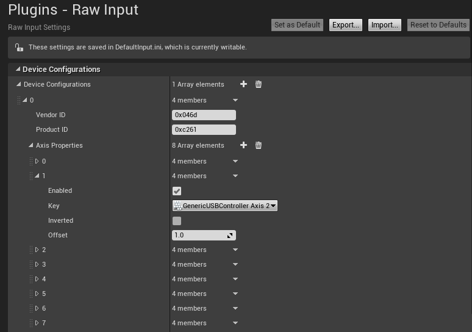
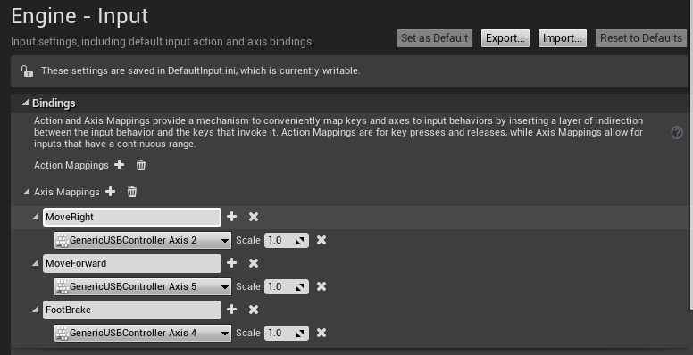

# Logitech G920 스티어링 휠 설치

AirSim과 함께 Logitech G920 스티어링 휠을 사용하려면 다음 단계를 따르십시오.

1. 스티어링 휠을 컴퓨터에 연결하고 드라이버 설치가 완료 될 때까지 기다립니다.

2. [여기](http://support.logitech.com/en_us/software/lgs)에서 Logitech 게임 소프트웨어 설치합니다.

3. 디버그하기 전에 AirSim 코드에서 값을 정규화해야합니다. CarPawn.cpp에서 (git의 현재 업데이트에 따라) 이 변경 사항을 수행하십시오. 
  382행에서 "Val"을 "1 – Val"로 변경합니다([0.0, 1.0]범위의 보완 값).  
  388행에서 "Val"을 "5Val - 2.5"로 변경하십시오(주어진 입력 범위를 [0.0, 1.0]에서 [-1.0, 1.0]으로 변경).
  404행에서 "Val"을 "4(1 – Val)"([0.0, 1.0] 범위의 보완 값)으로 변경하십시오.
 
4. AirSim 프로젝트를 디버그 합니다(스티어링 휠이 연결된 상태에서 - 중요).

5. Unreal 에디터에서 편집->플러그인->입력 장치로 이동하여 “Windows RawInput”을 활성화 하십시오.

6. 편집->프로젝트 설정->Raw Input으로 이동하여 새 장치 구성을 추가하십시오:
  Vendor ID : 0x046d (Logitech G920의 경우, 다른 경우에는 확인해야 합니다).
  Product ID: 0xc261 (Logitech G920의 경우, 다른 경우에는 확인해야 합니다).
  "Axis Properties"에서 "GenericUSBController Axis 2", "GenericUSBController Axis 4"및 "GenericUSBController Axis 5"가 모두 오프셋 1.0으로 활성화되어 있는지 확인하십시오.
  설명: axis 2는 스티어링 이동을 담당하며, axis 4는 브레이크, axis 5는 가스입니다. 클러치를 구성해야하는 경우 axis 3에 있습니다.
  
  

7. 편집->프로젝트 설정->입력, "Axis Mappings"의 바인딩으로 이동합니다. 
  "MoveRight" 및 "MoveForward" 그룹에서 기존 매핑을 제거하십시오.
  "MoveRight" 그룹에 새 axis 매핑을 추가하고, 1.0의 배율로 GenericUSBController axis 2를 사용합니다.
  "MoveForward" 그룹에 새 axis 매핑을 추가하고, 1.0의 배율로 GenericUSBController axis 5를 사용하십시오.
  새 axis 매핑 그룹을 추가하고 이름을 "FootBrake"로 지정하고 이 그룹에 새 axis 매핑을 추가하려면 1.0의 배율로 GenericUSBController axis 4를 사용하십시오.
  
  
  
8. 플레이하고 운전하십시오!

### 주의

디버그 후 처음으로 "플레이"할 때 휠을 터치하여 값을 "리셋"해야 합니다.

### 팁

게임 소프트웨어에서는 버튼을 키보드 단축키로 구성 할 수 있으며, 이를 사용하여 데이터 세트를 기록하거나 전체 화면으로 재생하는 단축키를 구성했습니다.
