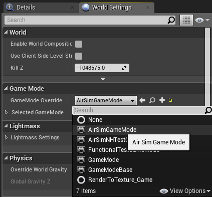

# Unreal 환경 생성과 설정
이 페이지에는 AirSim으로 Unreal 환경을 설정하기 위한 완벽한 지침이 포함되어 있습니다. Unreal Marketplace에는 몇 분 안에 사용할 수있는 [여러 가지 환경](https://www.unrealengine.com/marketplace/content-cat/assets/environments)이 있습니다. [turbosquid.com](https://www.turbosquid.com/) 또는 [cgitrader.com](https://www.cgtrader.com/)과 같은 웹 사이트에서 사용 가능한 환경을 약간의 노력만으로 사용할 수도 있습니다 ([튜토리얼 비디오](https://www.youtube.com/watch?v=y09VbdQWvQY&feature)). 
또한 몇 가지 [무료 환경](https://github.com/Microsoft/AirSim/issues/424)도 있습니다.


아래에서는 Landscape Mountain이라는 Unreal Marketplace에서 무료로 다운로드 할 수있는 환경을 사용하지만 다른 환경에서도 같은 단계를 밟습니다. 이러한 단계를 [Unreal AirSim 설정 비디오](https://youtu.be/1oY8Qu5maQQ)에서 수행한 것을 볼 수도 있습니다.

## Linux 사용자를 위한 참고 사항
Linux 용 `Epic Games Launcher`는 없습니다. 즉, 커스텀 환경을 만들려면 Windows 시스템이 필요합니다. Unreal 프로젝트 폴더가 있으면 Linux 머신으로 복사하십시오.

## 단계별 지침

1. AirSim이 빌드되어 있는지, [빌드 지침](build_windows.md)에 설명 된대로 Unreal 4.18이 설치되어 있는지 확인하십시오.
2. `Epic Games Launcher`에서 Learn 탭을 클릭 한 다음 아래로 스크롤하여`Landscape Mountains`를 찾으십시오. `Create Project`를 클릭하고 이 콘텐츠를 다운로드하십시오 (~ 2GB 다운로드).


3. `LandscapeMountains.uproject`를 열면 언리얼 에디터가 시작됩니다.


4. `파일 메뉴`에서 `새 C ++ 클래스`를 선택하고 클래스 유형에 `없음`을 그대로두고, `다음`을 클릭 한 다음 이름을 `MyClass`로 유지하고 `클래스 생성`을 클릭하십시오.
Unreal에는 프로젝트에 하나 이상의 소스 파일이 필요하기 때문에 이 작업을 수행해야합니다. 컴파일을 시작하고 `LandscapeMountains.sln` Visual Studio 솔루션 파일을 열어야합니다.

5. AirSim 저장소의 폴더로 이동하여 `Unreal\Plugins` 폴더를 `LandscapeMountains` 폴더에 복사하십시오. 이제 나만의 Unreal 프로젝트에 AirSim 플러그인이 있습니다.
6. `LandscapeMountains.uproject`를 다음과 같이 편집하십시오.

```
{
	"FileVersion": 3,
	"EngineAssociation": "4.18",
	"Category": "Samples",
	"Description": "",
	"Modules": [
		{
			"Name": "LandscapeMountains",
			"Type": "Runtime",
			"LoadingPhase": "Default",
			"AdditionalDependencies": [
				"AirSim"
			]
		}
	],
	"TargetPlatforms": [
		"MacNoEditor",
		"WindowsNoEditor"
	],
	"Plugins": [
		{
			"Name": "AirSim",
			"Enabled": true
		}
	]
}
```

7. Visual Studio와 'Unreal Editor'를 닫고 Windows 탐색기에서 LandscapeMountains.uproject를 마우스 오른쪽 단추로 클릭 한 다음 `Generate Visual Studio Project Files`을 선택하십시오.  이 단계는 Unreal 프로젝트에서 모든 플러그인과 소스 파일을 감지하고 Visual Studio 용 `.sln` 파일을 생성합니다.


팁 : `Generate Visual Studio Project Files`옵션이 없으면 Unreal Shell 확장을 적용하기 위해 컴퓨터를 재부팅해야 할 수도 있습니다. 여전히 없는 경우 Unreal 에디터에서 LandscapeMountains.uproject를 열고 `File` 메뉴에서 `Visual Studio Project 새로 고침`을 선택하십시오.

8. Visual Studio에서 `LandscapeMountains.sln`을 다시 열고 "DebugGame Editor"및 "Win64"빌드 구성이 활성 빌드 구성인지 확인하십시오.


9. `F5`를 눌러 `실행`하세요. Unreal 에디터가 시작될 것입니다. Unreal 에디터에서는 환경, 에셋 및 기타 게임 관련 설정을 편집 할 수 있습니다. 환경에서 가장 먼저 해야 할 것은 `PlayerStart` 객체를 설정하는 것입니다. Landscape Mountains 환경에는 `PlayerStart` 오브젝트가 이미 존재하며 `World Outliner`에서 찾을 수 있습니다. 위치가 그림과 같이 설정되어 있는지 확인하십시오. 이곳은 AirSim 플러그인이 차량을 생성하고 배치하는 곳입니다. 너무 높으면 플레이를 누르자마자 차량이 떨어져서 잠재적으로 무작위적인 동작을 취할 수 있습니다.


10. 아래와 같이 `Window/World Settings`에서, `GameMode Override`를 `AirSimGameMode`로 설정하십시오 :



11. Unreal 에디터가 로드 된 후, Play 버튼을 누르세요. 팁: '편집->에디터 개인설정'으로 가서, '검색'창에 'CPU'를 타이핑 하고 'Use Less CPU when in Background'이 체크 해제 되었는지 확인하세요. 이렇게 하지 않으면 UE 창이 focus를 잃을 때 UE 속도가 크게 느려집니다.

12. 편집한 내용을 반드시 `저장` 하십시오. Unreal 에디터에서 Play 버튼을 누르십시오. [AirSim 사용법](https://github.com/Microsoft/AirSim/#how-to-use-it)을 참조하세요.

축하합니다! 이제 나만의 Unreal 환경에서 AirSim을 실행하고 있습니다.

## 차량 선택 : 자동차 또는 Multirotor
기본적으로 AirSim은 어떤 차량을 사용할 것인지 묻습니다. [SimMode](settings.md#SimMode)를 설정하여 쉽게 변경할 수 있습니다. [자동차 사용](using_car.md) 가이드를 참조하십시오.

## 최신 버전의 AirSim으로 환경 업데이트
위 지침대로 환경을 구성한 후에는 로컬 AirSim 코드를 GitHub의 최신 버전으로 자주 업데이트해야합니다. 이 작업을 수행하기 위한 지침은 다음과 같습니다:

1. 먼저 환경의 루트 폴더에 [clean.bat](https://github.com/Microsoft/AirSim/blob/master/Unreal/Environments/Blocks/clean.bat) (또는 Linux 사용자의 경우 [clean.sh](https://github.com/Microsoft/AirSim/blob/master/Unreal/Environments/Blocks/clean.sh))를 넣으십시오. 이 파일을 실행하여 언리얼 프로젝트의 모든 중간 파일을 정리하십시오.
2. AirSim 리포지토리에서 `git pull` 다음에 `build.cmd`(또는 Linux 사용자의 경우`./build.sh`)를 수행하십시오.
3. [내 프로젝트]/Plugins 폴더를 AirSim/Unreal/Plugins 폴더로 바꾸십시오.
4. .uproject 파일을 우클릭하고 "Generate Visual Studio Project Files"옵션을 선택하십시오. Linux는 할 필요 없습니다.

## FAQ

#### 다른 멋진 환경은 무엇입니까?
[Unreal Marketplace](https://www.unrealengine.com/marketplace)에는 달에서 화성, 그리고 그 사이의 모든 것에 이르기까지 수십 가지의 사전 빌드 된 매우 상세한 [환경](https://www.unrealengine.com/marketplace/content-cat/assets/environments)이 있습니다. 우리가 테스트에 사용한 것은 [Modular Neighborhood Pack](https://www.unrealengine.com/marketplace/modular-neighborhood-pack)입니다.
당신은 이것 말고 다른 환경을 사용 할 수 있습니다. 또 다른 무료 환경은 [Infinity Blade Series](https://www.unrealengine.com/marketplace/infinity-blade-plain-lands)입니다. 또는 Epic Game Launcher의 Learn 탭을 보면 사용할 수 있는 무료 샘플이 많이 있습니다. 우리가 가장 좋아하는 것 중 하나는 100 평방 마일의 매우 상세한 환경 인 "A Boy and His Kite"입니다(주의 : 그것을 실행하려면 *매우* 고성능의 PC가 필요합니다!).

#### 재생 버튼을 누르면 차량 대신 어떤 종류의 비디오가 시작됩니다.
환경이 MatineeActor와 함께 제공되는 경우, 시작 데모 시퀀스를 피하기 위해 MatineeActor를 삭제하십시오. 예를 들어, 다른 방법으로 블루 프린트 버튼을 클릭 한 후 레벨 블루 프린트를 클릭 한 다음 이벤트 그래프에서 플레이 시작 이벤트를 보는 방법도 있습니다. "matinee"를 시작하는 모든 연결을 끊을 수 있습니다.

#### Unreal 프로젝트의 코드와 AirSim 리포지토리의 코드를 쉽게 동기화 할 수 있습니까?
물론입니다! `AirSim\Unreal\Environments\Blocks`에서 많은 `.bat` 파일 (리눅스의 경우 `.sh`)을 찾을 수 있습니다. 그냥 당신의 Unreal 프로젝트에 복사하십시오. 대부분은 아주 간단하고 자명합니다.

#### 지도에 대한 오류가 발생합니다.
프로젝트의 기본 맵을 설정해야 할 수도 있습니다. 예를 들어 Modular Neighborhood Pack을 사용하는 경우 Project Settings > Maps & Modes 에서 에디터 기본 맵과 게임 기본 맵을 Demo_Map으로 설정하십시오.

#### 환경에 대해 "프로젝트에 추가" 옵션이 표시되지만 "프로젝트 생성" 옵션이 표시되지 않습니다.
이 경우 Starter Content가 없는 새로운 빈 C++ 프로젝트를 작성하고 환경을 추가하십시오.

#### 이미 나만의 언리얼 프로젝트가 있습니다. AirSim을 이것과 어떻게 사용합니까?
위 섹션에서 빌드한 `Unreal\Plugins` 폴더를 Unreal 프로젝트 폴더의 루트에 복사하십시오. 위의 `LandscapeMountains.uproject`에서 보여준 것처럼 Unreal 프로젝트의 .uproject 파일에서 `AdditionalDependencies`키를 "Modules"오브젝트에 추가하십시오.
   ```
"AdditionalDependencies": [
    "AirSim"
]
   ```                
그리고 최상위 레벨 객체에 대한 `플러그인` 섹션도 추가하십시오 :
   ```
        "Plugins": [
            {
                "Name": "AirSim",
                "Enabled": true
            }
        ]      
  ```


