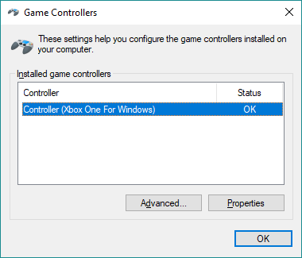

# XBox 컨트롤러

AirSim과 함께 XBox 컨트롤러를 사용하려면 다음 단계를 따르십시오:

1. PC 게임 컨트롤러에 XBox 컨트롤러가 표시되도록 연결하십시오:



2. QGroundControl을 시작하면 다음 설정 아래에 새 조이스틱 탭이 표시됩니다:


이제 라디오를 조정하고 몇 가지 편리한 버튼 동작을 설정하십시오. 예를 들어, 'A'버튼이 드론을 장착하고 'B'는 수동 비행 모드로 설정하고 'X'는 고도 고정 모드로 설정하고 'Y'는 위치 고정 모드로 설정하도록 컨트롤러를 설정합니다. 또한 " roll, pitch, yaw에 지수 곡선 사용 "이라고 표시된 박스를 체크 할 때 컨트롤러의 느낌이 더 좋습니다. 작은 움직임에도 민감하게 반응하기 때문입니다.

QGroundControl은 위의 MavLinkTest에 의해 설정된 UDP 프록시 포트 14550을 통해 Pixhawk을 찾습니다.
AirSim은 위의 MavLinkTest에서 설정 한 다른 UDP 서버 포트 14570을 통해 Pixhawk을 찾습니다.
이 시점에서도 자율 비행을 위해 모든 QGroundControl 컨트롤을 사용할 수도 있습니다.


3. 다음과 같이 MavLinkTest.exe를 사용하여 Pixhawk 직렬 포트에 연결하십시오:
````
MavLinkTest.exe -serial:*,115200 -proxy:127.0.0.1:14550 -server:127.0.0.1:14570
````

4. 이러한 `~/Documents/AirSim/settings.json` 설정으로 AirSim Unreal 시뮬레이터를 실행하십시오 :
```
"Vehicles": {
    "PX4": {
        "VehicleType": "PX4Multirotor",

        "SitlIp": "",
        "SitlPort": 14560,
        "UdpIp": "127.0.0.1",
        "UdpPort": 14570,
        "UseSerial": false
    }
}
```

## 고급

조이스틱 탭이 QGroundControl에 표시되지 않으면 도구 모음에서 왼쪽의 자주색 "Q"아이콘을 클릭하여 환경 설정 패널을 표시하십시오.
일반 탭으로 이동하여 가상 조이스틱 체크박스를 선택하십시오. 설정 화면(톱니 아이콘)으로 돌아가서 매개 변수 탭을 클릭하고 검색 창에 `COM_RC_IN_MODE`를 입력 한 후 값을 `Joystick/No RC Checks` 또는 `Virtual RC by Joystick`으로 변경하십시오.

### 다른 옵션

[원격 컨트롤러 옵션](remote_control.md) 참조